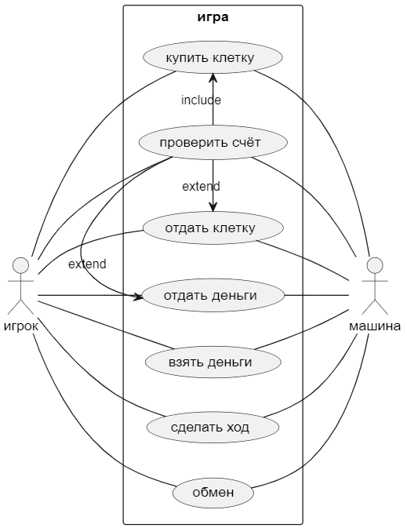

# Практика №1 "Модельно-ориентированный подход к проектированию"

#### Вариант 14 "Игра Монополия"

Обзор: Игра человека против машины

#### Выполнил:
Студент Тыван М. В.
Группы БИСО-02-20

### Листинг Monopoly.puml

    @startuml Monopoly
    left to right direction
    actor игрок
    actor машина
    rectangle игра {
        игрок -- (взять деньги)
        игрок -- (отдать деньги)
        игрок -- (сделать ход)
        игрок -- (купить клетку)
        игрок -- (отдать клетку)
        игрок -- (проверить счёт)
        игрок -- (обмен)
        (купить клетку) <- (проверить счёт) :include
        (отдать клетку) <- (проверить счёт) :extend
        (отдать деньги) <- (проверить счёт) :extend
        (взять деньги) -- машина
        (отдать деньги) -- машина
        (сделать ход) -- машина
        (купить клетку) -- машина
        (отдать клетку) -- машина
        (проверить счёт) -- машина
        (обмен) -- машина
    }
    @enduml

### Листинг Classes.puml

    @startuml "Монополия классы"
    left to right direction

    class игрок{
        Имя: string
        Счёт: varchar
        Клетки: string
        Взять_деньги()
        Отдать_деньги()
        Проверить_счёт()
        Сделать_ход()
        Купить_клетку()
        Отдать_клетку()
        Обмен()
    }

    class машина{
        ID: string
        Сложность: varchar
        Клетки: string
        Взять_деньги()
        Отдать_деньги()
        Проверить_счёт()
        Сделать_ход()
        Купить_клетку()
        Отдать_клетку()
        Обмен()
    }

    class игра{
        Клетки: string
        Отдать_деньги()
        Взять_деньги()
        Продать_клетку()
    }

    игра <-- игрок: действие
    игрок <-- игра: ответ на действие
    игра <-- машина: действие
    машина <-- игра: ответ на действие
    игрок <--> машина: обмен

    @enduml

