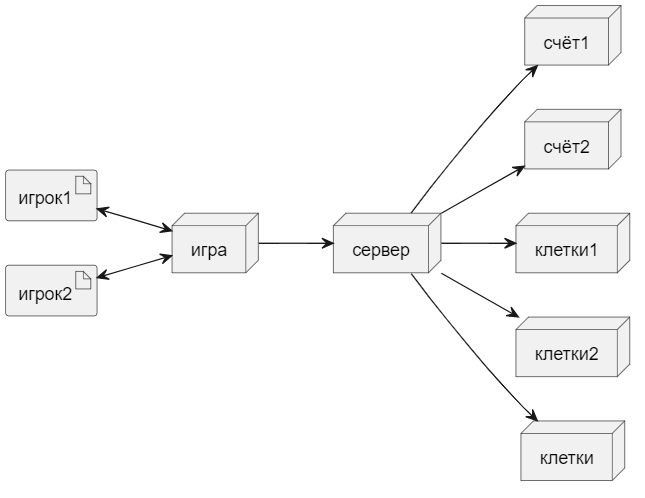

# Практика №2 "Модельно-ориентированный подход к проектированию"

#### Вариант 14 "Игра Монополия"

Обзор: Игра человека против машины

#### Выполнил:
Студент Тыван М. В.
Группы БИСО-02-20

### Листинг Monopoly.puml

    @startuml "Монополия"

    actor игрок
    participant игра
    participant клетка
    participant аренда
    participant купить
    participant заплатить
    participant ход
    participant счёт
    participant кубики

    игрок --> игра: Запустить
    activate игра

    игра --> игрок: Выполните действие
    activate игрок
    activate ход
    activate счёт

    игрок --> игра: Действие

    игра --> ход: Инициировать ход
    activate кубики

    ход --> кубики: Бросить кубики

    кубики --> ход: Рандомное число n (от 1 до 12)

    ход --> игрок: Переместиться на n
    activate клетка

    игра --> клетка: Проверить свободна ли
    клетка --> игра: Свободна
    activate купить

    клетка --> игра: Чужая
    activate аренда

    аренда --> игра: Нужно x денег
    игрок --> игра: Заплатить
    игра --> аренда: Передать деньги
    deactivate аренда
    deactivate клетка

    клетка --> игра: Своя

    купить --> игра: Проверить хватает ли денег

    игра --> игрок: Проверить счёт
    игрок --> счёт: Проверка
    счёт --> игрок: Хватает
    счёт --> игрок: Не хватает
    игрок --> игра: Купить
    игрок --> игра: Передать ход
    deactivate игрок

    @enduml

### Листинг Classes.puml

    @startuml "Классы"
    left to right direction

    artifact игрок1
    artifact игрок2
    node сервер
    node игра
    node счёт1
    node счёт2
    node клетки1
    node клетки2
    node клетки

    игрок1 <--> игра
    игрок2 <--> игра
    игра --> сервер
    сервер --> клетки1
    сервер --> клетки2
    сервер --> счёт1
    сервер --> счёт2
    сервер --> клетки
    @enduml

